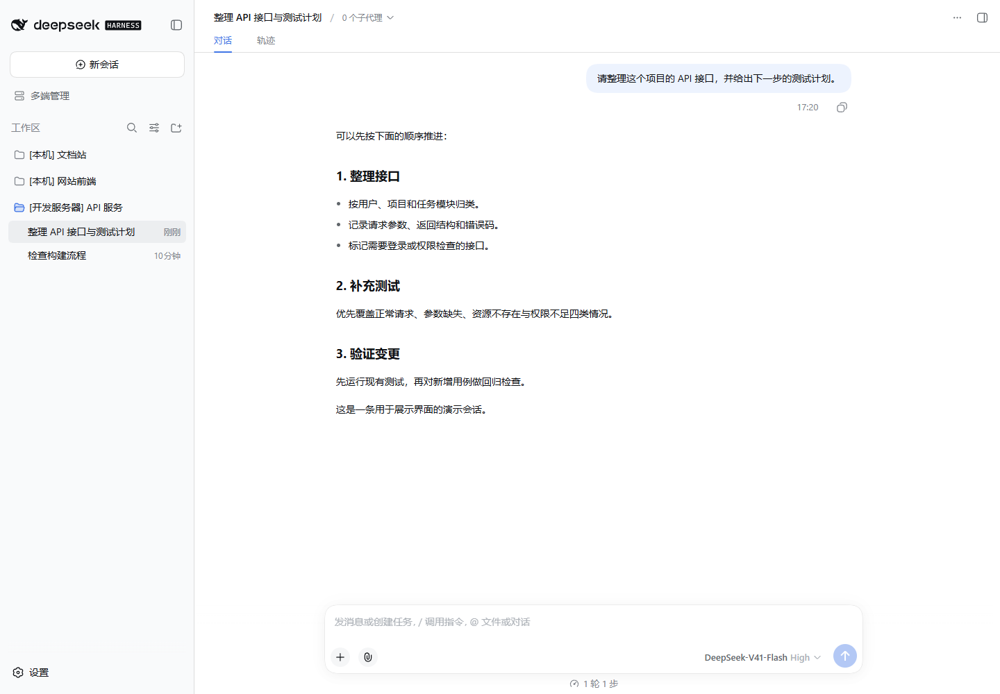
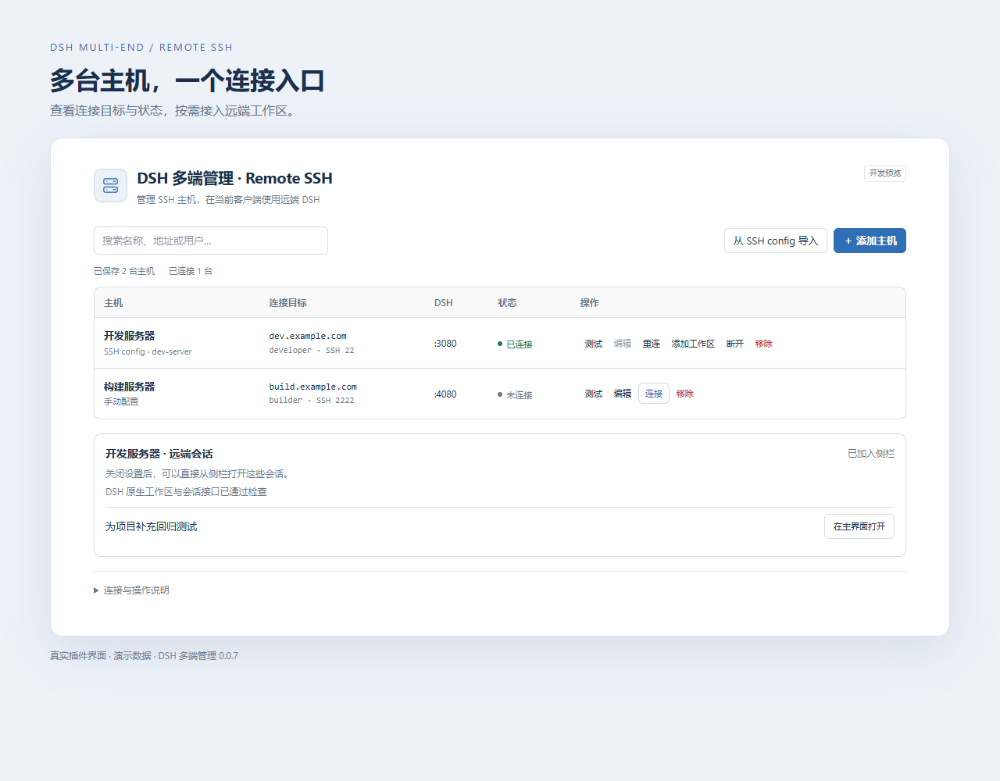
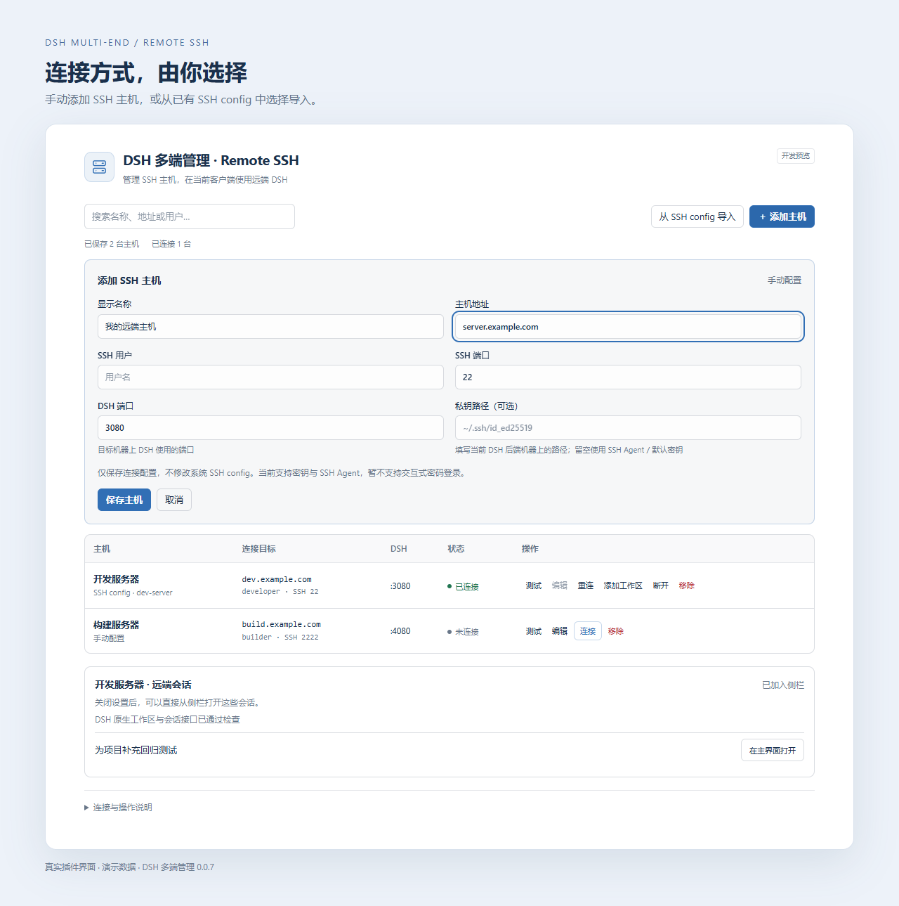

# DSH 多端管理 · Remote SSH

DSH 多端管理：通过 SSH 远程连接多台机器，在同一原生侧栏管理工作区与会话，任务在所属机器运行。支持手动添加主机或导入已有 SSH config；全局设置仍使用主后端。

Remote SSH multi-host management for DSH. Access remote workspaces and sessions in one native sidebar, with tasks running on their original machines.

**0.0.8 开发预览。适配基线：DSH 0.1.7-rc.1。尚未完成跨平台实机验收与完整交互支持。**

## 界面预览

以下为真实 DSH 页面和插件组件，使用虚构的演示主机与会话。





<details>
<summary>查看手动添加主机界面</summary>



</details>

## 安装与使用

当前提供 [v0.0.8 安装包](https://github.com/Wazzfhaha/dsh-multi-end/releases/tag/v0.0.8)，适配基线为 DSH 0.1.7-rc.1。

在运行主 DSH 后端的终端中执行：

```bash
dsh plugin --profile web add -w https://github.com/Wazzfhaha/dsh-multi-end/releases/download/v0.0.8/dsh-ssh-workspaces-0.0.8.tgz
```

如使用其他 profile，请替换 `web`。安装后重启对应后端，打开“设置 → DSH 多端管理”，手动添加 SSH 主机或从 SSH config 导入。

远端需运行 DSH，但不需要安装本插件。曾手动安装或使用本地链接安装本插件的用户，请先检查旧配置，避免重复注册。

详见 [安装说明](docs/install.md) 和 [兼容性与限制](docs/compatibility.md)。

## 0.0.8 更新

- 适配 DSH 0.1.7-rc.1 的 Web Gateway、侧栏搜索与工作区接口。
- 添加工作区时默认加载远端主目录，输入路径自动显示候选，点击或回车进入目录。
- 修复远端 DSH 使用系统目录弹窗时无法浏览目录的问题，自动通过现有 SSH 的 SFTP 子系统读取目录。
- 多端管理支持新建远端文件夹，再添加到原生工作区侧栏；不修改 DSH 主体或远端启动配置。

## 0.0.12 更新

- 侧栏只保留“多端管理”；添加远端工作区统一在多端管理中进行。
- 补充跨平台审计，明确平台、登录方式与尚未实测的组合。

## 0.0.11 修复

- 将远端会话和工作区接入 DSH 0.1.7 实际使用的 Web Gateway 分派路径，使原生侧栏与搜索能够读取远端结果。

## 0.0.10 修复

- 修正 0.1.7-rc.1 会话控制流只有 `projections` 的协议检查与聚合，避免把正常远端误报为不兼容。
- 接受 0.1.7-rc.1 登录成功后的 `./` 重定向，同时继续接受旧版 `/`；连接失败只显示安全的阶段提示。

## 0.0.8 更新

- 兼容 DSH 0.1.7-rc.1 的工作区置顶状态和原生侧栏会话搜索；远端搜索结果与本机会话一起显示。
- 在“多端管理”的已连接主机中添加远端工作区，再浏览或填写其目录。原生“+”仍用于主后端。
- 远端会话支持新版原生置顶、取消置顶和取消归档操作。

## 0.0.7 修复

- 主后端重启后，自动恢复此前成功连接的 SSH 主机；主动断开后不再自动连接。升级后需先成功连接一次，以记录恢复意愿。
- 远端会话的运行、完成与活动通知实时进入原生侧栏，无需刷新页面。
- 不保存带令牌的登录链接，不重发消息或任务。手动登录链接连接仍需重新提供凭证。

## 已实现

- 手动添加主机、选择导入 SSH config；SSH 和 DSH 端口独立配置。
- 聚合原生工作区侧栏，标注后端来源；使用原生会话界面。
- 支持远端目录浏览和新建文件夹；目录接口不可用时回退到 SSH SFTP。也可手动输入绝对路径添加工作区。
- 会话改名、归档、取消归档、置顶与同一工作区内排序；已归档会话从管理页快捷列表隐藏。
- 显式路由对话、取消、历史、分叉、附件、消息队列及会话 skills 请求。
- 断线有限次重试、手动重连；保留未发送草稿，不自动重发失败消息。
- 连接时只读检查工作区与会话控制基础协议；这不代表已识别远端版本或验证全部操作。

## 当前限制

工具审批、用户提问和第三方交互卡片尚未转发；这些场景需要使用所属后端的界面。远端目录接口处于系统弹窗模式时，自动通过现有 SSH 的 SFTP 子系统浏览和新建文件夹；要求该 SSH 用户启用 SFTP，且 SFTP 与 DSH 看到的绝对路径一致（不支持路径不同的 chroot）。远端文件侧栏、跨机器移动、全局配置同步不在当前支持范围。Windows/macOS 远端尚未实机验证。详见 [兼容表](docs/compatibility.md)。

[安装与使用](docs/install.md) · [手动上传 GitHub](docs/github-publishing.md)

## 开发

使用 Node.js 24+：

```sh
npm ci
npm run build
npm test
```

`src/browser/` 是浏览器源文件，`src/client.js` 是生成入口。测试使用 Node 内置框架和本地模拟服务，不会连接真实 SSH 主机或发送模型请求。真实后端验收须使用独立 profile 和专用测试会话。

直接在这个固定 Git 仓库中开发、运行和提交；升级版本不更换目录，也不再导出源码副本。`node_modules/` 和 `.runtime/` 不纳入 Git。当前包保留 `private: true`，避免误发布到 npm。Linux 登录探测的补充测试可运行 `python3 -B tests/remote-probe.test.py`。

插件依赖 DSH 的运行时 gateway 适配，不修改其安装文件；它不是上游承诺稳定的多后端扩展接口。更新 DSH 后需要重新验收。

MIT 许可证仅覆盖本项目代码；DSH 和依赖项保留各自许可证。
